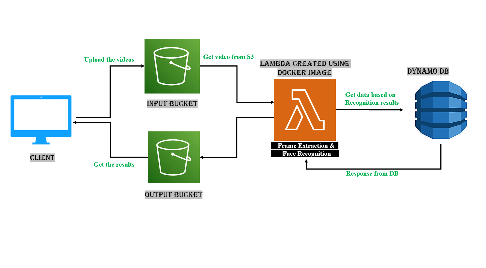

## Problem Statement

The goal of this project is to create a cloud app that will serve as a smart classroom assistant for educators. This assistant collects videos from the user's classroom, performs face recognition on the videos, searches the database for the recognized students, and returns to the user the relevant academic information for each student.
Using the PaaS cloud, we aim to create an elastic application that can automatically scale out and in on demand and at a low cost. This application will be built specifically with AWS Lambda and other AWS support services. This application will continue to provide valuable cloud services to users, and the technologies and techniques we learn will help us build many more in the future.

## Architecture

### Autoscaling
Autoscaling is accomplished for this project by utilizing an AWS fully managed service called AWS Lambda.
AWS Lambda is a computing service provided by Amazon Web Services that allows running code without having to provision or manage servers. Lambda runs the code on a high-availability compute infrastructure and handles all compute resource administration, such as server and operating system maintenance, capacity provisioning and automatic scaling, and logging. Lambda can be used to run code for almost any type of application or backend service if it is written in a language supported by Lambda.
When we invoke your function for the first time, AWS Lambda creates an instance of the function and runs its handler method to process the event. When the function returns a response, it remains active and waits for additional events to be processed. If we call the function again while the first event is being processed, Lambda creates another instance and the function handles both events at the same time. As new events arrive, Lambda routes them to available instances and creates new ones as needed. When the number of requests drops, Lambda terminates unused instances in order to free upscaling capacity for other functions.

## Testing and evaluation
To carry out testing, we initially started with uploading a single mp4 file to the input S3 Bucket. After receiving a success response, we tried uploading multiple video files to the input bucket using the workload generator. We tried with a total of 100 files and validated the result for each of the csv files generated in the output bucket. After testing the application with a significant amount of test cases, the application was ready for submission and demonstration.

## Code Explanation
Docker can build images automatically by reading the instructions from a Dockerfile. The DockerFile contains all the configurations and the commands needed to install the necessary libraries in the container and assemble to image.

Once the S3 input bucket is loaded with an object, the Lambda function triggers the face__recognition_handler present in the handler python file. The entry point for the handler method is configured in the DockerFile which triggers a script file that receives the handler method as an argument. When the handler is triggered, using the ffmpeg framework, frames are extracted from the mp4 files and encoded using the built-in python library face_recognition. The encoded data is then compared with the
encodings present in the encoding file. If the encodings match, then the recognized face is obtained as a result. Using the results, we query the dynamoDb to obtain the desired information and the results are dumped into the S3 bucket in the form of a csv file. We use the Workload generator to generate multiple requests to the S3 bucket.

### Installation Steps
After the handler python file is ready, the next step is to create a docker image and deploy it on the AWS. We create an ECR repository on the AWS and useBelow commands to create and push the image to the ECR (Elastic Container Registry).

*AWS configure (We configure the login credentials using the Access and the Secret key Id)*
*aws ecr get-login-password --region us-east-1 | docker login --username AWS --password-stdin 668107029855.dkr.ecr.us-east-1.amazonaws.com*
*docker build -t project_repo .*
*docker tag project_repo:latest 668107029855.dkr.ecr.us-east-1.amazonaws.com/project_repo:latest*
*docker push 668107029855.dkr.ecr.us-east-1.amazonaws.com/project_repo:latest*

The commands to push the image to the ECR are available in the respective ECR repositories.
Once the image is pushed, the next step is to create a Lambda function and an input and output bucket in AWS. The Lambda function is created using the Container image in the ECR. For mac users, arm64 architecture is selected and the timeout and memory allocated for the Lambda function is increased.

An S3 trigger is added to the Lambda function. After lambda is triggered, the logs can be seen under the monitor tab as shown in the image above